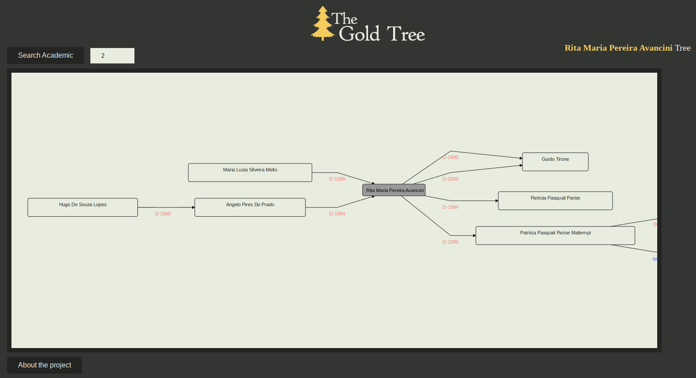

# thegoldtree

Academic genealogy investigates the relationships between student researchers and academy professionals. In recent years, it proved to be a powerful technique to help analyze the spread of scientific knowledge. Tools that make to visualize these relationships among academics easier are potentially useful and have been proposed. 

This work specifies and describes the development of a Web information system for creating and visualizing academic genealogy trees from a set of metadata extracted and integrated from multiple sources. The proposed system allows a researcher to query and track information about his or her advisers and graduate students at any level. A case study was explored to validate the system using data from more than 570 thousand theses and dissertations.

The project was developed in the Information Management
Research Group (GINFO) of the Universidade Federal do Rio Grande (FURG) and
was partially funded by the FAPERGS.

[Published Paper](https://www.researchgate.net/publication/333435352_The_Gold_Tree_An_Information_System_for_Analyzing_Academic_Genealogy)

[Website](http://thegoldtree.c3.furg.br) 

